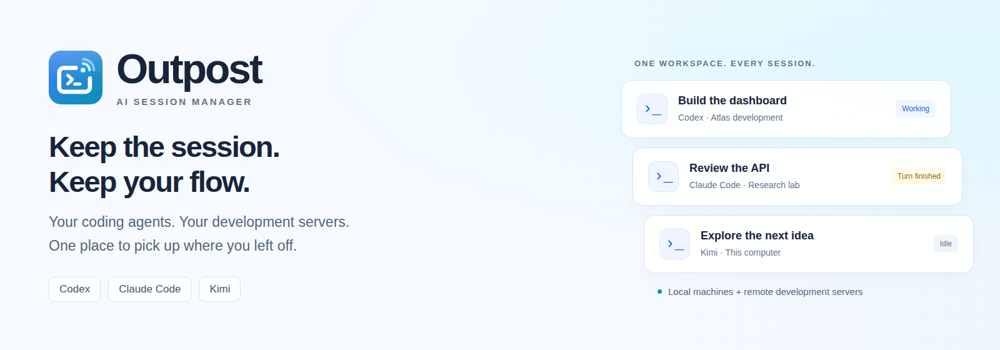
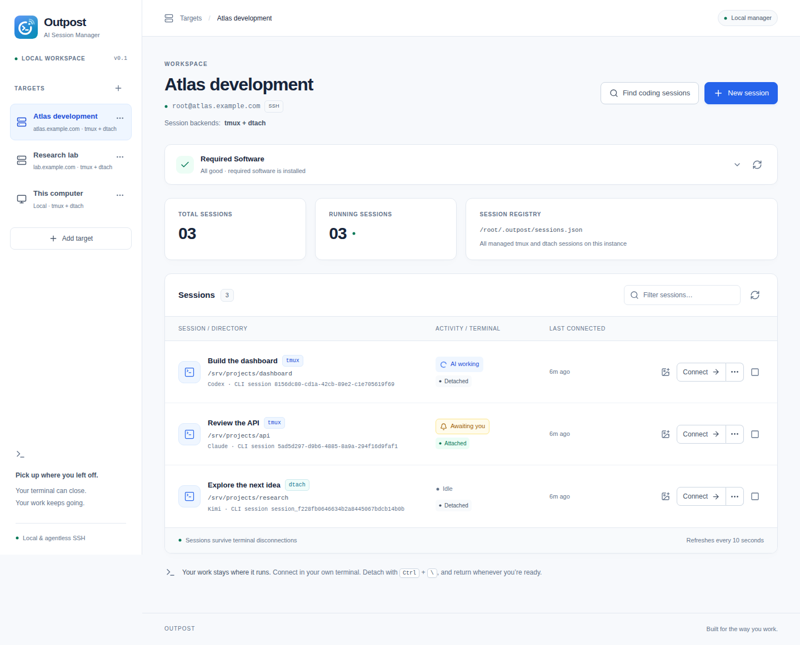
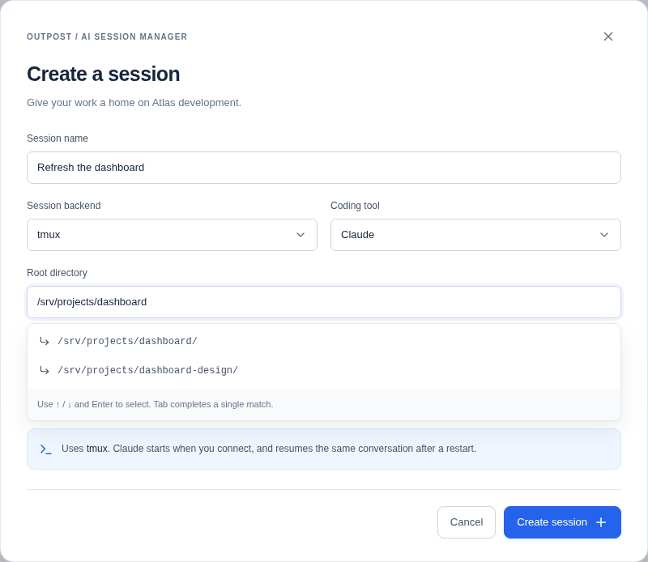
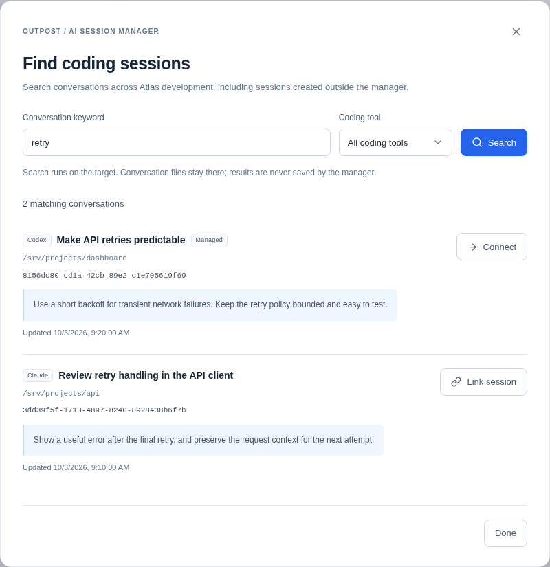
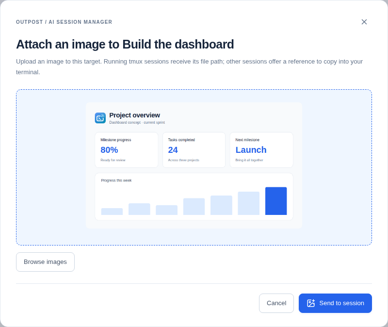

# Outpost



One workspace for **Codex, Claude Code, and Kimi** sessions across your local computer and remote development servers.

**Watch the three-minute overview:**

https://github.com/user-attachments/assets/cd7c1fc0-613a-4670-92c5-39d41a36f4cf

AI agents are becoming part of everyday coding: building features, reviewing changes, and exploring ideas. That work often spans several dev servers, each with its own projects and environments. Connecting from a laptop over ordinary SSH can be fragile: a dropped connection can interrupt an agent tied to the terminal, clipboard features do not carry over as expected, and pasting a design image becomes awkward. As conversations spread across machines, it gets harder to remember where each piece of work is running.

Outpost keeps those sessions organized and accessible. Choose a server, create a named session, select your coding tool and project directory, and connect. Your remote agents run independently of the computer you use to reach them. Close the terminal or your laptop, and they keep running while the dev server stays on. Return from the same computer or another one and reconnect to the same session. Manage several servers and multiple sessions on each, with local sessions in the same workspace too.

- **Connect with one click in local mode.** Open a terminal on your computer, already attached to the coding session. Local mode is the default and needs no account.
- **Use a web terminal in hosted mode.** Select **… → Launch with web terminal** to connect from your browser, including on a phone. The service holds the SSH connection to your server.
- **Send images to remote agents.** Paste or drop an image into the manager and send it to the coding session, with automatic insertion into supported running sessions.
- **Find earlier conversations.** Search by topic, phrase, or error message and reopen the session you need. Remote searches run on your dev servers; conversation history stays there and is not downloaded unnecessarily.
- **See which agent needs you.** Activity indicators distinguish working, idle, and finished turns waiting for your input. Checking a finished turn clears its notice.
- **Get required software ready.** See what is installed, identify what is missing, and automatically install required software from the manager.
- **Keep your servers agentless.** There is no extra manager service to keep running on each dev server. Tool adapters leave room to add custom AI harnesses as your workflow grows.
- **Give each user a workspace in hosted mode.** Sign up, verify your email, and connect your own servers with an account-specific SSH key. Profile settings and password recovery are built in.

Explore the [promo project](promo-v2/README.md) for the film's editable sources, screenshots, and rebuild instructions. Generated audio and movies are kept outside Git.

Built with React, Vite, SCSS, Fastify, and TypeScript. Hosted accounts use Node's built-in SQLite; no database service is required. See [Contributing](CONTRIBUTING.md), [Security](SECURITY.md), and [third-party notices](THIRD_PARTY_NOTICES.md).

## Deployment modes

Choose how Outpost runs with `OUTPOST_MODE`. **Local is the default when the variable is unset.** Hosted mode is an explicit choice for operating a platform or service. The choice applies to the whole installation and takes effect after restarting the backend.

| | Local tool — default | Hosted service — opt-in |
| --- | --- | --- |
| Setting | Unset, or `OUTPOST_MODE=local` | `OUTPOST_MODE=hosted` |
| Runs on | Your computer | A server reachable by users |
| Authentication | No login, signup, or user accounts | Verified signup, login, profile, and password recovery |
| Targets | This computer / WSL and SSH servers | SSH servers only |
| Management SSH credentials | Your existing OpenSSH config, agent, or identity file | A separate Outpost SSH key and known-host records for each account |
| Main connection workflow | **Connect** launches a desktop terminal on the Outpost computer | **… → Launch with web terminal** opens a browser terminal; the backend connects to the target with an uploaded key |
| Desktop launch | One click, using your saved terminal preference | Unavailable; a service cannot open a user's desktop terminal |
| Phone access | Intended for use with your desktop terminal | Browser terminal with touch controls and reconnect support |
| Network | Loopback only; optionally access through an SSH tunnel | HTTPS reverse proxy in production, with WebSocket forwarding |
| Manager state | Personal `targets.json` | `accounts.sqlite`, per-user workspaces, and encrypted terminal-key uploads |

Both modes manage the same persistent tmux/dtach coding sessions on execution hosts. Changing deployment mode does not migrate target settings or accounts: local targets remain in the top-level store, and hosted targets remain in their user workspaces. Use separate `OUTPOST_DATA_DIR` values for separate installations. An existing `.env` with `OUTPOST_MODE=hosted` stays hosted; unset it or select `local` to use the local tool.

## Run the local tool (default)

Requires Node.js 24+, npm 11+, and Git. SSH targets also require an OpenSSH client on the manager and connecting computers. Choose the shell matching your terminal:

| Terminal / shell | Requirements |
| --- | --- |
| Linux, macOS, or a WSL tab | Bash and curl |
| Windows PowerShell or PowerShell 7 | PowerShell 5.1+ and the Windows OpenSSH Client optional feature |
| Windows Command Prompt | Uses Windows PowerShell to download and run the connection script |

[Windows Terminal](https://learn.microsoft.com/en-us/windows/terminal/) hosts different shells. Choose the command matching the current tab: PowerShell, Command Prompt, or Bash for WSL. SSH connections from native Windows do not require WSL. **Local Windows sessions use WSL**, with coding tools and project directories inside the selected distribution.

```sh
npm ci
npm run dev
```

Open **http://127.0.0.1:5173**. The API runs on `127.0.0.1:3000`, proxied through Vite. The local workspace opens immediately, without signup or login. Add a local or SSH target, create a session, and click **Connect** to launch a terminal on the computer running Outpost. Alternatively:

```sh
npm run build
npm start
# Open http://127.0.0.1:3000
```

No `.env`, mail service, public URL, or user database is needed for local mode. `NODE_ENV=production` does not enable accounts: a built app still defaults to local. You may copy `.env.example` to `.env` to customize the port or data directory. `OUTPOST_DATA_DIR` overrides `~/.outpost`; run one manager process per data directory. Local mode, development, and Vite require loopback listeners.

For local mode on another machine, forward its web port to the **same** port on your computer, e.g. `ssh -L 3000:127.0.0.1:3000 manager-machine`, then open `http://127.0.0.1:3000`. Desktop launch still opens an app on the manager computer. **Connection options → Copy command** lets you connect from your own computer instead; it must also have SSH access to the target. Use consistent SSH aliases on both computers. Leave the identity field empty to use each SSH client's configuration, or use `~/.ssh/key` to resolve against each computer's home directory. Absolute identity paths must exist on both; Windows and WSL have separate SSH configurations and home directories.

The optional web terminal is also available for direct SSH targets in local mode via the session menu. It uses a separately uploaded encrypted key on your local manager and introduces no accounts. The desktop **Connect** action remains the default.

## Run a hosted service

Set `OUTPOST_MODE=hosted` explicitly in `.env` or the server environment. The service requires Node.js 24+, npm 11+, and an OpenSSH client. The backend manages users' SSH credentials and makes management and web-terminal connections directly from the service to their targets. Users need a browser, including a mobile browser; the service cannot launch apps on their computers. The welcome page and session list identify this mode.

To try it locally, copy `.env.example` to `.env`, change `OUTPOST_MODE` to `hosted`, choose a separate `OUTPOST_DATA_DIR`, and run `npm run dev`. Without mail credentials, loopback development shows simulated verification and password-reset links in the UI. For public deployment, use the [production configuration below](#production-configuration).

### User workflow

1. **Create an account.** Enter your name, email, and a password of at least 8 characters. Verify the link in your inbox to sign in. Verification links last 24 hours; sign-in can resend them.
2. **Authorize your Outpost key.** Copy your public key from the welcome page or **Your account** and add it to `/root/.ssh/authorized_keys` on your dev server. The manager uses this account's Ed25519 key, with separate known-host records. It does not use a shared SSH agent, manager identity file, or SSH aliases.
3. **Add an SSH target.** Enter a hostname/IP and port (default 22), select tools and backends, and manage sessions as usual. Hosted accounts support SSH targets; local execution and desktop launching are available in local mode.
4. **Launch a browser terminal.** Choose **… → Launch with web terminal** beside a session. On first use, upload a private SSH key authorized on that target. The backend opens and holds the connection; it works from phones without a local SSH client. Browsing a workspace or preparing a command never automatically launches a web terminal.

There are two SSH credentials in this workflow: the generated **Outpost account key** is used by the service for session management, software checks, and other target operations; the **uploaded private key for a target** is used for its web terminal. Both need access to that target's root account. Keep the service's account public key authorized even after uploading a terminal key.

**Connection options** provides an optional command to paste into a terminal on your own computer. That computer needs its own SSH access to the target. The target's optional **Your terminal's identity file** field applies only to this copied command; it does not select a key on the service. Hosted mode offers no **Connect** desktop-launch action or **Launch terminal** button.

**Your account** lets you change your name and password. **Forgot password?** sends a single-use reset link that lasts one hour. Resetting or changing a password signs out all devices and expires their connection commands. Signing out expires commands issued by that login. Coding sessions keep running on their servers.

### Web terminal on phones

Open a session’s **…** menu and choose **Launch with web terminal**. On first use, upload or paste an SSH private key authorized for root on that target, and enter its passphrase if encrypted. Outpost saves the key encrypted for your account and this target. **Manage key** lets you replace or remove it. Only this explicit menu choice opens a web terminal; **Connection options** prepares a command for your own terminal.

The terminal supports touch input, a text/paste field, Ctrl, Esc, Tab, arrows, Ctrl+C, Enter, and Shift+Enter. Outpost holds the SSH PTY for 10 minutes after a network drop and restores its screen on reconnect. Closing the dialog detaches immediately. Signing out, resetting your password, removing the target, or replacing/removing its uploaded key closes affected web terminals. Remote tmux/dtach coding sessions continue running; terminating a session still stops it. Up to four web terminals can be held per account, with one viewer per terminal. Web terminals currently support SSH targets with a direct hostname/IP and port, rather than SSH configuration aliases, jump hosts, or local targets.

`OUTPOST_TERMINAL_ENCRYPTION_KEY` is optional in every mode, including production. When unset, Outpost generates a persistent 32-byte key at `OUTPOST_DATA_DIR/terminal-keys/master-key` on the first upload and protects it with mode 0600. To manage the key separately, set the variable to a stable 32-byte base64 value (`openssl rand -base64 32`) and back it up separately. Existing uploads need their original encryption key; keep the same override when upgrading an installation that already uses it. Ed25519, RSA, and ECDSA private keys are accepted, up to 64 KiB; a passphrase unlocks an encrypted upload once and is discarded. The normalized key is encrypted using AES-256-GCM, and APIs return only fingerprints and upload metadata. The SSH host key must match any existing account known-host record; otherwise it is pinned on first web connection, and subsequent changes are rejected. Only upload keys to an Outpost installation you trust: its backend must decrypt them in memory to connect.

Your reverse proxy must forward WebSocket upgrades for `/api/web-terminals/*/socket`. With nginx, include these directives in the existing HTTPS `location /` that proxies to Outpost:

```nginx
proxy_http_version 1.1;
proxy_set_header Host $http_host;
proxy_set_header Upgrade $http_upgrade;
proxy_set_header Connection "upgrade";
proxy_read_timeout 75s;
```

Use one backend process per data directory. Held web terminals and their bounded screen buffers are in memory, so a backend restart requires launching the web terminal again; the remote coding session persists. Back up the entire data directory, including `terminal-keys/` and its generated master key, to retain uploads. Existing `terminal-keys/development-master-key` files are reused automatically. If you use the environment override, also back up that key.

### Production configuration

For a public hosted installation, build the app and configure `.env` using this template:

```dotenv
OUTPOST_MODE=hosted
NODE_ENV=production
PUBLIC_APP_URL=https://outpost.example.com
HOST=127.0.0.1
PORT=3000
OUTPOST_DATA_DIR=/var/lib/outpost
ENGAGE_LAB_USERNAME=your-engagelab-username
ENGAGE_LAB_API_KEY=your-engagelab-api-key
ENGAGE_LAB_FROM_EMAIL="Outpost <no-reply@example.com>"
# Optional, if the proxy runs on the same machine:
OUTPOST_TRUST_PROXY=127.0.0.1,::1
```

Run `npm run build && npm start` behind an HTTPS reverse proxy that preserves the public Host header. `PUBLIC_APP_URL` must be an origin, without a path. Production refuses to start without HTTPS or verification email delivery. Email uses EngageLab; credentials belong in the server environment. Trust only your actual proxy addresses for client IP rate limits. Development email simulation is limited to loopback and is disabled in production.

Back up the entire data directory while the manager is stopped: `accounts.sqlite` contains users, token hashes, login sessions, and the signing secret; `users/<id>/` contains target settings, the account's private SSH key, public key, and known-host file. Keep this state private and persistent across restarts. Per-user target ownership is checked on every API operation. Users authorized for the same remote root account share that server's sessions and conversation history according to its SSH permissions.

### Hosted container

Build the production image with `docker build -t outpost .`. The image serves the frontend and API together on port 3000, includes the OpenSSH client, and runs as user 1000. It selects hosted mode; provide the production email credentials and `PUBLIC_APP_URL` through the container environment. Mount a persistent volume at `/state`; application data is stored in `/state/outpost`.

```sh
docker run -d --name outpost --restart unless-stopped \
  --env-file /etc/outpost/production.env \
  -e HOST=0.0.0.0 -e OUTPOST_DATA_DIR=/state/outpost \
  --mount type=volume,source=outpost-state,target=/state \
  -p 127.0.0.1:3000:3000 outpost
```

Place an HTTPS reverse proxy in front of the container, preserving the Host header and forwarding WebSockets. Run only one replica per volume. In Kubernetes, use a single-replica StatefulSet with retained storage, and set the health probe's Host header to the configured public hostname. The health endpoint is `/health`. Back up the whole volume, including the generated terminal encryption key.

The container workflow publishes `ghcr.io/kevinwang15/outpost:<full-commit-sha>` and `:latest` for commits on `main`. Pin production deployments to a commit and registry digest. This image is intended for hosted deployments; run the local tool directly on your computer for desktop terminal launching.

When upgrading an existing local installation, select `OUTPOST_MODE=local` (or leave it unset) and keep `OUTPOST_DATA_DIR` pointed at your current configuration directory to retain target settings and signing keys. Execution hosts now store sessions under `~/.outpost`. Stop existing sessions before moving their state into that directory, then reconnect from Outpost to restart them with the current socket layout and tmux session names. Existing coding-tool conversation histories remain available to search and link.

## Screenshots

These captures use the local application with example targets and mock session data.

**One workspace for your coding sessions.** Switch between local and SSH targets, see which agents are working or waiting for you, and reconnect from the session list.



**Create a session.** Choose your coding tool and session backend, then find the project directory with live suggestions.



**Find an earlier conversation.** Search on the selected target, reconnect to a managed session, or link an existing coding-tool conversation.



**Bring an image into the conversation.** Paste, drop, or browse for an image and preview it before sending it to the session.



To refresh the banner and screenshots after a UI change:

```sh
npx playwright install chromium
npm run docs:capture
```

The capture script starts the Vite frontend and Fastify API with mock services and a temporary target store, then saves PNGs through Chrome DevTools Protocol's `Page.captureScreenshot`. The banner and example design are rendered from HTML and CSS in [`scripts/readme`](scripts/readme). Set `OUTPOST_README_PORT` if the default capture port, `4193`, is in use.

## Local and SSH targets

Local targets and desktop launch are available in the default local mode. Hosted users manage SSH targets with account keys and open browser terminals with uploaded keys.

| Target | Where commands run | User | Connection shells |
| --- | --- | --- | --- |
| SSH | Remote Linux dev machine | SSH root | Bash, PowerShell, cmd |
| Local on Linux/macOS | Computer running the manager | Current manager user | Bash wrapper, then the user's interactive login shell |
| Local on Windows | Selected WSL distribution on the manager computer | Distribution's default user at the first check, then pinned to that user | PowerShell or cmd, invoking `wsl.exe` |

**Local means the manager computer, not the browser computer.** Run a local copy-command there as the same user, or use Launch terminal. A browser accessed through a tunnel does not make its own computer the local target. Local commands never connect to localhost over SSH. Windows distributions are pinned when adding the target, even if you leave the field blank to select the current default. Changing WSL's default later does not redirect existing targets.

Installations run only after submitting a reviewed script, as the target's execution user. Linux package scripts use passwordless `sudo -n` for a non-root local user, or fail with instructions to edit the script/install manually. macOS scripts use an existing Homebrew installation. Windows requires an already working WSL distribution and runs checks/installations inside it. If the manager itself runs inside WSL, it behaves as a Linux manager.

## Workflow

1. **Add a target.** Select **SSH** or **Local**, name it, and choose **tmux** (screen restoration and scrollback), **dtach** (minimal persistence), or both, alongside one or more required coding tools. Adding saves settings without installing software. SSH targets take a hostname/IP; local mode also supports SSH aliases and your existing SSH config/agent. Port and identity file are optional. Hosted management uses the account key and port 22 by default; its identity file field applies only to your terminal. SSH uses root. Local targets need no host or key; on Windows you can select a WSL distribution.
2. **Check Required Software.** The detail page runs a fresh shell inspection through SSH or locally. It checks Bash, Python 3.9+, all selected backends (dtach 0.9+), selected coding tools, and `lsof` when macOS dtach is selected. The panel collapses with an **All good** tick when all requirements pass; expand it to see executable paths and versions. Missing or broken requirements expand the panel with warnings. **Auto install** opens a syntax-highlighted, editable POSIX shell script. **Run installation** executes the exact submitted text and streams stdout/stderr into the modal. Closing the modal triggers a fresh software check and session-list fetch. **Configure required software** changes backend and coding-tool selections for new sessions and immediately rechecks requirements. SSH accepts new host keys on first use and rejects changed keys.
3. **Create a named session.** Choose an installed backend and coding tool from the configured selections, then an absolute root directory on the target or `~/path`. A missing backend or its dependencies does not prevent using another healthy backend. The root directory field discovers matching directories live on the selected target as you type, including `~/` paths. Use ↑/↓ and Enter, click a suggestion, or press Tab to complete a single match. Existing directories are required unless you check **Create the directory if it doesn’t exist**; you can always type a new path manually. Names are unique per backend on each execution host. The chosen tool, backend, manager UUID, native coding CLI session ID, storage directory, and stable socket path are stored in the target registry. Creation allocates the conversation identity without submitting a prompt; the interactive coding process starts when a terminal attaches. The session list shows the native ID and a tmux or dtach badge beside each name; both backends appear together.
4. **Connect in your deployment mode.** In **local mode**, click **Connect** to open your preferred available desktop terminal on the Outpost computer, with a recommended fallback. Its **… → Connection options** dialog lets you choose a terminal app, launch it, or copy a command into an existing window. If automatic launch fails, a toast explains the failure and options open. In **hosted mode**, choose **… → Launch with web terminal** to attach in your browser using the service-held SSH connection. The **Connection options** button only prepares a command for your own terminal; desktop launching is unavailable. Web terminals are always an explicit choice. Reattachment uses the existing coding process; restarting a stopped session uses its saved tool choice.
5. **Leave and return.** Press **Ctrl+\\** to detach or close the terminal. The coding tool keeps running. Click **Connect** in local mode, reopen **Launch with web terminal** in hosted mode, or copy another command to return. Command links expire after 15 minutes; sessions do not. Desktop and copied-command connections run independently of Outpost after attachment. A web terminal requires the backend to remain running; after a backend restart, launch it again to reattach to the persistent coding session.
6. **Terminate a session.** Use the stop button beside a running session and confirm. This stops the coding tool and its child processes, disconnects attached terminals, and fetches the session list again. The record, conversation identity, and project files remain; connecting again resumes that conversation in a new coding-tool process.
7. **Attach an image.** Use the image button beside a session and paste, drop, or browse for a PNG, JPEG, GIF, or WebP image (up to 16 MB). The image is uploaded as a file under `~/.outpost/clipboard/<session>/`, keeping the newest 20 per session. Codex, Claude, and Kimi receive the plain image path. Live tmux sessions (attached or detached) receive one bracketed paste without pressing Enter; review the input in your terminal before submitting it. For dtach or stopped sessions, copy the reference from the dialog. Uploading never starts or restarts a session. Text copy uses OSC 52 through tmux for terminals that support it.
8. **Manage a target.** Right-click a sidebar target or use its three-dot button for **Open target** and **Remove target**. The button also supports keyboard and touch input. Removal requires confirmation and only forgets the connection in this manager; running sessions stay on the execution machine.

**Desktop terminals (local mode).** **Connect** tries your saved favorite for the manager's OS first, then each available terminal in the order below until a launcher succeeds. Connection options offer **Launch terminal** for the explicitly selected app when it is available; an explicit choice never silently opens a different app. Both open a terminal on the **computer running Outpost**. Through an SSH tunnel, your browser and Outpost may run on different computers: use Copy command to connect from your own favorite terminal. Automatic launch uses Bash on macOS/Linux and PowerShell 7 when installed (otherwise Windows PowerShell) on Windows, independently of the shell selected for copying commands:

| Manager platform | Supported terminals in fallback order | Shell |
| --- | --- | --- |
| macOS | iTerm2 (recommended), Terminal (system fallback), WezTerm, kitty, Alacritty | Bash |
| Windows | Windows Terminal (recommended), system terminal (system fallback), WezTerm, Alacritty | PowerShell |
| Linux desktop | GNOME Terminal, Ptyxis, Konsole, WezTerm, kitty, Alacritty, Xfce Terminal, XTerm | Bash |

Desktop detection is best effort: Linux requires `DISPLAY` or `WAYLAND_DISPLAY` and an installed terminal on PATH; macOS requires ownership of the logged-in user's console and discovers app bundles in standard system/user Applications folders; Windows checks an interactive, non-service session and searches PATH plus standard installation folders. iTerm2 opens a new window through its [AppleScript interface](https://iterm2.com/documentation-scripting.html); macOS may request Automation permission. Automatic launch falls back to Terminal if that request fails. Availability is checked again on launch, but display access or terminal startup can still fail. A successful launch response means the window was requested; SSH or coding-tool errors after startup appear in that terminal. The selected session is validated live on the target before launching. Local launch scripts are stored in a private temporary directory and delete themselves on startup, with cleanup if launch fails. Closing the manager leaves the opened terminal running; closing the terminal preserves the coding-tool session as usual.

Dialogs close through their explicit Close, Cancel, or Done controls; backdrop clicks and Escape never discard a draft. Escape in the root-directory field dismisses suggestions. Dialogs use a wider desktop layout, group related choices side by side, and scroll within the viewport on smaller screens.

Directory suggestions are read-only and never cached. Clicking outside the suggestions closes only the suggestion list and preserves the session draft. Lookups wait 250 ms after typing, cancel when superseded or the dialog closes, and fetch again when you refocus the field. They show up to 50 matching child directories; type a dot to include hidden directories. No directories or session records are created during lookup.

Software checks are read-only on the execution host, work without Bash or Python, and bound each version probe to four seconds. They do not initialize the registry. A fresh instance returns an empty live session list once its runtime dependencies are available; its first session creation initializes `~/.outpost/sessions.json` with private permissions, locking and atomic writes. Existing registries and processes are preserved.

Installation jobs belong to the manager process. Closing a modal or leaving an instance disconnects its log viewer while the installation continues. Reopen **View installation log** to see retained output and follow progress; job completion triggers another software inspection. Only one installation runs per target entry. The latest log is bounded to 256 KiB and retained until another installation, target removal, or manager restart. Scripts have a 15-minute timeout. The manager does not persist jobs or logs. Distinct entries for the same execution host can encounter their package manager's install lock and may require a retry. A target with an active install cannot be removed until it finishes.

Default support scripts use apt, dnf, yum, apk, pacman, or Homebrew. Coding tool presets download the official installers for [Codex](https://github.com/openai/codex#installing-and-running-codex-cli), [Kimi](https://www.kimi.com/code/docs/en/), and [Claude](https://code.claude.com/docs/en/quickstart). The generated scripts show their URLs and dependency commands before execution. A successful script exit is followed by actual detection; success does not imply the edited script installed the required executable. Version checks do not authenticate providers or verify access to a model.

SSH attachment loads root's detected interactive Bash or Zsh login environment. Local attachment loads the user's Bash or Zsh interactive login shell, falling back to Bash for other login shells. This includes PATH additions such as Kimi's `~/.kimi-code/bin` in `.bashrc` when sourced by the login profile, or `.zshrc` for Zsh. Existing PATH order is preserved; common user and Homebrew binary directories are appended. The coding tool inherits that environment. Missing-tool errors identify the user whose startup files to check.

| Session choice | Command |
| --- | --- |
| Codex | `codex` |
| [Kimi](https://www.kimi.com/code/docs/en/kimi-code-cli/guides/getting-started) | `kimi` |
| [Claude](https://code.claude.com/docs/en/quickstart) | `claude` |

Sessions with different coding tools can coexist on the same target and backend. The choice is required when creating a session and remains part of that session’s record; each session keeps its individual tool choice even if the target’s required selection later changes. Session names remain unique within each backend, regardless of tool.

Expand **Arguments and environment variables (optional)** when creating a session to customize its launch. Arguments are one string appended to the selected command and evaluated by Bash, with normal quoting and variable/command expansion. For example, `--model "$MODEL"` uses the session's `MODEL` environment variable as one argument. Environment names must be shell identifiers, and their values are passed literally, including spaces, quotes, newlines, and empty strings. They extend or override the login environment for that coding tool without changing other sessions. Both options are saved in the instance's session registry and reused when a stopped session starts again; reconnecting to a running session keeps its existing process and environment. Environment values are stored in the registry (mode `0600`), not the manager's target configuration. The API accepts optional `args` and `env` fields on session creation, up to 32 variables, 4096 characters per value, 8192 characters of arguments, and 16 KiB combined serialized launch settings. Invalid argument syntax is rejected before a session is saved.

This unshipped project accepts only the current configuration, registry, and connection-ticket schemas. Invalid or incomplete data and unknown fields are rejected without rewriting records. Target entries use `kind: "ssh" | "local"` and explicit nonempty `backends` and `tools` arrays. Execution-user metadata may be stored in `environment`; software status is never persisted. Session records have their own `backend`, `tool`, `env`, `args`, `cliSessionId`, and `cliSessionEnv`; new sessions without launch options save an empty object and string. There are no registry migrations or compatibility defaults.

## Coding conversations and finder

CI validates native identity allocation, cold resume, activity acknowledgement,
and conversation discovery against these pinned tool versions:

| Coding tool | CI version |
| --- | --- |
| Codex CLI | 0.159.2 |
| Claude Code | 2.1.284 |
| Kimi Code CLI | 2.1.1 |

Other versions may work, but upstream protocol and storage changes need a fresh
adapter check. `npm run test:coding` uses temporary homes and a local model
fixture, without provider credentials.

Every managed session has two identities: `id` owns its persistent terminal socket; `cliSessionId` identifies the conversation that Codex, Claude, or Kimi resumes. The adapter pins the CLI storage directory in `cliSessionEnv` so a changed login environment cannot silently attach to a different store. Session environment overrides apply before allocation; the pinned storage directory takes precedence on future starts. Session-selection flags such as `--continue` and `--session-id` belong to the manager. Literal selectors are rejected during creation, and expanded arguments are checked again before launching the CLI. Bash arguments are evaluated once; arguments after `--` are treated as positional input.

New Codex sessions obtain their ID, provider, and version through a short-lived native app-server connection, then reserve the ID in a metadata-only rollout because Codex does not persist an empty thread before its first turn. A bounded scan can reuse the newest CLI metadata for the same provider to preserve build-specific fields; the new thread gets its own identity, workspace, and context-window ID, with previous instructions and ancestry removed. No conversation turns are copied. New Claude sessions reserve a UUID for `--session-id`; once its transcript exists, attachment uses `--resume` with its exact path. Kimi creates a native session through its short-lived ACP connection. Codex and Kimi require valid CLI configuration before allocation. These operations submit no conversation prompt or model request. Restarts use `codex resume <id>`, Claude's native flags, or `kimi --session <id>`.

Click **Find coding sessions** on a target and submit a conversation keyword. **All coding tools** searches all three native stores, including conversations created outside the manager; the tool selector narrows the request. Searches are case-insensitive literal matches across conversation text, including recorded tool output and reasoning. Native IDs and conversation titles also match. Each submit runs a new target-side scan: SSH targets execute it through SSH, and local targets use the same runtime locally or inside WSL.

Results include the CLI ID, tool, working directory, timestamps, and one excerpt of at most 280 characters. **Link session** opens a named manager-session form with the conversation's tool and working directory fixed; choose an installed backend from the target's requirements. Linking validates that the conversation still exists and prevents duplicate links across backends. Already managed results offer **Connect** in local mode or **Connection options** in hosted mode. Linking or deleting a manager record preserves CLI-owned history files.

The finder reads Codex's active and archived rollout JSONL files, Claude's project and [subagent transcripts](https://code.claude.com/docs/en/sub-agents#resume-subagents), and Kimi Code's session index, state, and agent wire logs. Claude and Kimi subagent matches link to their parent conversation. It includes custom CLI stores referenced by managed sessions. Discovery and decoding belong to individual adapters; these native vendor formats are isolated from the manager registry. Kimi uses the current Kimi Code CLI, `KIMI_CODE_HOME` (default `~/.kimi-code`), `session_…` identifiers, and the `kimi acp` protocol.

Conversation files are never downloaded, indexed, cached, or saved on the manager computer. Only result metadata and a bounded excerpt cross the transport and remain in the open dialog's memory. Closing it clears the results; queries and excerpts are absent from browser storage, target configuration, and the session registry. The search API uses a POST body, so keywords do not appear in URLs. Each scan has a 12-second, 256-MiB, and 20,000-file budget, skips records larger than 8 MiB, and returns at most 50 matches. Partial results and unreadable or incomplete records produce visible warnings; a CLI can continue appending while a search runs.

## AI activity

Session rows show **AI working**, **Idle**, or **Awaiting you**, separately from the terminal's Attached/Detached/Stopped status. Awaiting you means the main agent finished a turn that you have not checked. Click the badge to mark it checked, reconnect to the session, focus its terminal window, or type in an existing manager attachment. Checking changes the activity to Idle; submitting a new prompt changes it to AI working when the CLI records the new turn. Merely opening a target or generating a copy command leaves the notice unread.

Each adapter reads its CLI's native files directly on the execution machine:

| Coding tool | Native activity signal |
| --- | --- |
| Codex | Rollout `task_started`, `task_complete`, and `turn_aborted` events |
| Claude | Main transcript user/assistant records ordered by native timestamps and assistant `stop_reason`; tool use stays working, `end_turn` marks completion |
| Kimi | Main agent's wire log: `turn.prompt`, `turn.ended`, and active-turn cancellation |

Live session requests probe activity again on the target. Readers work backwards in small blocks, bounded to 4 MiB per conversation. Unreadable files, invalid activity metadata, or a turn marker outside that window show **Activity unavailable** with an explanation instead of guessing. Cancelled and failed turns return to Idle. A finished turn stays unread even if the CLI exits. Importing a conversation or starting a stopped session establishes a new baseline so previous turns do not produce fresh notices.

Only acknowledgement offsets and checksums are saved under the target's `~/.outpost/activity/`; conversation content and keystrokes are never copied into manager storage. Checks are shared by all manager computers using the same target registry. Each completion has a token, so acknowledging an older displayed turn cannot clear a newer completion. Terminal input captures its checkpoint under the same lock as other checks, preventing an older input from restoring an already checked notice. The attachment helper enables terminal focus reporting and observes input while forwarding the terminal stream. Automatic terminal replies and focus-out events do not count as checking. Focus detection depends on terminal support; input and explicit checking work independently. The helper ends with the attachment; tmux/dtach continues owning the coding process.

## Persistence and lifecycle

| Data | Location |
| --- | --- |
| Local target settings and signing key | Manager machine: `~/.outpost/targets.json` |
| Hosted accounts and signing secret | Service: `~/.outpost/accounts.sqlite` |
| Hosted target settings and management SSH keys | Service: `~/.outpost/users/<id>/` |
| Uploaded web-terminal keys and generated encryption key | Manager/service: `~/.outpost/terminal-keys/` |
| Authoritative session records | Each execution host/user: `~/.outpost/sessions.json` |
| Live tmux or dtach sockets | Each execution host/user: `~/.outpost/sockets/<session-uuid>.sock` |
| AI activity acknowledgement offsets | Each execution host/user: `~/.outpost/activity/<session-uuid>.json` |
| Coding tool configuration and history | Each tool’s own existing files on the execution host |

Connection settings live in the manager: one personal store in local mode, or a separate store per account in hosted mode. The browser stores your terminal preference; hosted authentication uses an HttpOnly cookie. Every target click (including the selected target), page reload, and manual refresh reads the session list again through its transport, with browser and API caching disabled. The URL stores only the selected target ID so reloads reopen that target. Failed reads show an error instead of an old session list; removing and re-adding the same target rediscovers its existing sessions. Registry changes are protected by `flock` and atomic file replacement. Concurrent initial attachments share the same lock to avoid duplicate processes. Short relative socket paths work even with long home-directory names.

- **Ready:** record exists, never connected.
- **Attached:** the session is running with a terminal attached.
- **Detached:** the process is running without a terminal attached. This does not indicate whether the coding tool is working or waiting for input.
- **Stopped:** a previously connected coding tool process has exited or the host rebooted. Connecting starts a fresh process in the same directory with the saved coding CLI session ID, resuming the same conversation.

The persistence guarantee covers terminal closure, SSH disconnection, and manager shutdown. A host reboot or explicitly exiting/killing the coding tool stops the process; the record remains. For **tmux**, the server retains the screen and scrollback and restores the display on attachment. Each manager session has a dedicated tmux server/socket; personal tmux configuration is not loaded, and the status bar is hidden. The standard tmux prefix remains available (for example, Ctrl+B then [ for copy mode); Ctrl+\ is also bound to detach. Managed attachments disable timed paste guessing so a rapid detach key is not forwarded to the coding tool.

tmux attachments enable extended keys so a terminal can distinguish Shift+Enter from Enter. Pane negotiation is retried briefly to handle coding tools that reset keyboard modes during startup; delayed writes retain the original terminal descriptor. The connection dialog includes **Newline with Shift+Enter** help and a copyable Windows Terminal action to add to existing settings when needed. The outer terminal must send a distinct modified key; the manager cannot distinguish keys that arrive as identical bytes.

For **dtach**, output is forwarded without maintaining a scrollback buffer. After attachment, the connection helper briefly reduces the terminal width by one column and restores it. This triggers a full repaint even when reconnecting at the same size; no keyboard shortcuts are injected into the coding tool. A real terminal resize during that interval takes precedence. See [dtach](https://github.com/crigler/dtach) for its terminal behavior.

The backend is stored on each session record. A target entry displays all managed tmux and dtach sessions for its execution host/account, including backends deselected in Required Software. Its detail page and sidebar show the backends configured for new sessions. Backend and coding-tool selections control requirements and new-session choices; changing them never converts, restarts, or hides existing sessions. Attachment, termination, and deletion resolve the session by UUID and use its saved backend. Local targets for the same account, or SSH entries for the same host, share the authoritative session registry and see the same live records. Names remain unique within each backend. Checks and registry initialization preserve existing data; installation requires an explicit reviewed script submission.

Termination identifies the selected dtach process by its live Linux `/proc` socket ownership, or queries the dedicated tmux server for its PID. It signals that process and its descendants, waits up to three seconds for them to stop, then forcefully kills any remaining targets. Process identity checks (and pidfds where available) guard against PID reuse. Linux uses `/proc`; macOS uses `lsof` for socket ownership and Apple's libproc for executable paths and precise process start times. Unreadable processes owned by other users are skipped. No custom daemon is installed. Repeated termination of a stopped session is harmless.

Session deletion is allowed only after its process stops, and preserves project files and coding tool history. Removing a target only forgets its local connection settings; it never stops processes or deletes its registry.

## Architecture

```text
React UI → Fastify API → shared SessionClient
                          ├─ SshTransport → OpenSSH → shell
                          └─ LocalTransport → shell / wsl.exe → shell
                                                       ↓
                                           shared session-runtime.py
                                             ├─ sessions.json + lock
                                             ├─ coding adapters → native CLI session files
                                             └─ tmux/dtach → coding tool + PTY

Copy / Launch terminal → shared script renderer → selected transport → same runtime
```

`shared/session-manager.ts` defines software requirements used by both live inspection and the UI's session choices. `backend/sessions.ts` owns typed session operations. The `SessionTransport` contract owns shell support, execution context, and command construction; `ssh.ts` and `local.ts` implement it. `shell.ts` owns quoting and the login environment independently of the Python payload in `runtime.ts`. `software.ts` inspects availability/version without Python, `software-scripts.ts` generates editable presets, and `installations.ts` owns streamed jobs. `process.ts` handles bounded command execution; `terminal.ts` renders shell-specific connection scripts. Desktop launching consumes the rendered script without knowing the transport.

Image data travels through the management script’s stdin, keeping large uploads out of command-line arguments. The runtime validates the execution user and session before decoding or writing an image; both the manager and runtime enforce the 16 MB limit.

`coding_protocol.py` defines the common coding-session adapter interface. Each adapter owns its ID format, storage directory, reserved arguments, exact-ID attachment, and activity-file locations. It delegates allocation, discovery, text decoding, and native turn-marker decoding to its store. `coding_sessions.py` owns the bounded search scan; `coding_rpc.py` owns short-lived JSON-RPC subprocess connections. `coding_activity.py` reads native turn markers and handles completion checks; `activity_state.py` owns atomic target-side acknowledgement checkpoints. `terminal_attachment.py` observes input/focus in an ephemeral PTY relay, preserves terminal geometry and byte streams, and ends without stopping the persistence server. The attachment payload includes the common contract, lightweight adapters, checkpoints, and relay; transcript readers and allocation code are included only in management requests. Compression keeps Windows commands within their native argument limit without a target-side manager service.

The Python runtime is executed per operation, locally or sent through SSH; it is never installed as an agent. Only registry files, locks, sockets, and support packages remain on SSH hosts. One implementation supplies atomic JSON updates, path discovery, mixed-backend session lists, startup, attachment, and termination. Session data is never mirrored in the manager's target configuration. Local requests check the detected user's UID and home directory to prevent a copied command from silently using a different account. Paths and names are encoded data, not interpolated shell text. The runtime is compressed to fit Windows native command-line limits. Management commands have timeouts and a strict success/error envelope. UTF-8 decoding preserves characters across subprocess output chunks. Errors are surfaced in the UI. Target inputs and saved configuration share validation schemas without coercion, defaults, or migration.

The HTTP layer composes these services. `target-lifecycle.ts` serializes installation startup and target removal per target; a pending removal cannot lose track of a concurrently started installer. Installation execution runs outside this critical section, and shutdown prevents new jobs from starting. `connections.ts` signs and validates connection tickets, including required identity, shell, and expiry fields. `request.ts` cancels target reads when their HTTP viewer disconnects, including session lists and connection preparation. `process.ts` terminates host workers on cancellation or timeout, and rejects promptly even when descendants retain their output pipes. Mutations and installation jobs have their own lifetimes. `TargetStore` serializes atomic writes and exposes creation plus specific environment/requirements updates; creation cannot overwrite an existing target ID. Run one manager process per data directory.

The React app keeps target selection and target dialogs in one reducer so late mutations cannot override newer navigation or close a different draft. Each target visit mounts its own `TargetWorkspace`, which coordinates session actions with one tagged dialog state. `SessionList` owns list presentation and filtering. `useLiveSessions` owns live session fetching and cancellation; `useRequiredSoftware` owns live checks; `useSessionConnection` owns terminal launch, connection preparation, and notifications. Opening another dialog or leaving a target cancels pending connection preparation. `RequiredSoftware` and `InstallModal` own the check, script-editing, and log flows. Late mutation completions cannot fetch into another workspace. Software reads and log subscriptions are canceled when leaving a workspace; installations continue independently.

The UI imports named [Lucide React](https://lucide.dev/guide/react) components directly for icons and loading indicators. `LucideProvider` in `frontend/main.tsx` sets the shared default size. `TargetNavigationItem` presents sidebar actions using Radix Context Menu and Dropdown Menu primitives for positioning, focus, and dismissal; the app owns target-removal confirmation.

The interface uses a light theme with white surfaces, slate text, and blue actions. Shared color and font tokens in `frontend/style.scss` also style the installation editor; activity and software states use blue, green, amber, and red. Native font stacks work without external font downloads. Responsive layouts keep session controls and dialog actions reachable on smaller screens, and honor reduced-motion preferences.

The API rejects foreign browser origins, requires a custom header on writes, and validates Host to reject DNS rebinding. Hosted routes check verified cookie sessions and account ownership; local routes retain loopback restrictions. Connection scripts require HMAC-signed links and are never cached or included in request logs. SSH config, known-host validation, and SSH authentication still apply to the terminal connection.

`accounts.ts` owns account routes, email delivery, cookies, and request limits;
`account-store.ts` persists users and hashed tokens in SQLite. `account-ssh.ts`
supplies private account keys and target stores. `AuthGate` checks the server's
mode and session before mounting a workspace, clears it on logout or expiry,
and synchronizes account changes across browser tabs.

## Checks

Typechecks use the native TypeScript 7 compiler. ESLint uses Microsoft's separate TypeScript JavaScript API package through the `typescript` dependency, following the [official tooling setup](https://devblogs.microsoft.com/typescript/announcing-typescript-7-0/#running-side-by-side-with-typescript-60).

```sh
npm run check             # lint, typechecks, production build, API and starter tests
npm run test:local        # Linux/macOS: lifecycle, keyboard/focus/input, AI activity, both backends
npm run test:integration  # Docker required: isolated real SSH + both backends + interactive fixture
npm run test:coding       # Installed CLIs: native IDs, cold resume, turn completion/errors; fake providers
npx playwright install chromium
npm run test:ui           # browser workflow, failed check/install retry, desktop/mobile checks
npm run test:desktop      # Linux: real XTerm under Xvfb; requires xvfb, xauth, and xterm
npm run test:deployment   # Linux + Docker + Chromium: both modes, production HTTPS/email/SSH/mobile
```

`test:deployment` uses the production build created by `npm run check` (or run
`npm run build` first). It creates disposable local and hosted managers, two
OpenSSH targets, an HTTPS nginx proxy, and a local EngageLab-compatible mail
service. It exercises real XTerm launches under Xvfb, signup and verification,
account and key isolation, all six tool/backend combinations, encrypted-key
upload without an encryption override, phone input and resizing, proxy/backend
restarts, key removal/replacement, termination/resume, and password-reset
revocation. Only coding tools and email delivery are
fixtures; session management, SSH, terminal persistence, TLS and WebSockets use
the real implementations. Screenshots are saved under `test-results/deployment-*.png`.
Containers, networks, certificates, credentials and private state are cleaned up
after the run. This suite requires no real email or model credentials.

The software suite starts an Alpine SSH container with Bash, Python, and backends absent. It verifies read-only detection, real package installation, live logs, edited-script failure/recovery, version checks, lazy registry creation, and matching inspection/attachment PATH under a root Zsh login shell. It uses coding-tool fixtures and does not download vendor binaries.

Coding-session tests cover all three native formats, tool output, Unicode, literal shell punctuation, fresh reads, custom storage directories, duplicate links, partial records, bounded results, and absence of conversation text in saved manager data. Attachment tests check expanded session selectors and ensure Bash arguments are evaluated once. Real SSH tests exercise the finder on disposable servers and verify native IDs across termination and restart. `test:coding` additionally checks installed vendor binaries in isolated homes: Codex and Kimi allocate and cold-resume without a model turn; subsequent vendor turns use loopback Responses, Chat Completions, and Anthropic fixtures. Completion, acknowledgement, and provider-error states are checked against all three binaries. Missing binaries are skipped locally; CI pins the native versions listed above and requires all three. Activity tests also cover stale completion checks, acknowledgement during a turn, delayed Claude transcript writes, partial and rewritten transcripts, bounded reads, input/focus events, terminal-reply filtering, and same-process reattachment with both persistence backends.

The lifecycle SSH tests build disposable Debian servers without either backend installed and run the full lifecycle for both tmux and dtach. They verify installation of only the chosen backend, editable backend requirements, mixed-backend lists shared by same-host entries, attachment after deselecting a backend, isolation from personal tmux configuration, concurrent registry writes, shell quoting, terminal hangup, explicit detach, same-PID reattachment and automatic same-size repaint, manager restart, concurrent connections, stale socket recovery, termination of attached and detached sessions (including a TERM-resistant child), isolation from other sessions, remote rediscovery, and preservation of all three coding tool executables. They verify mixed Codex/Kimi/Claude records, the executable actually launched, reattachment and restart with the saved tool, Kimi and Claude startup without Codex present, and a clear error if a selected tool is missing. They also reproduce Kimi installed in `/root/.kimi-code/bin` with PATH set behind a `.bashrc` interactive guard, checking PATH precedence, inherited variables, reattachment, and restart. They also check live directory discovery, tilde paths, symlinks, hidden directories, result limits, literal spaces and shell punctuation, and operation without a session registry. Browser and API tests cover completion, request cancellation, stale responses, and lookup failures. They use interactive heartbeat fixtures in place of the coding tools, so they need no provider credentials and make no model requests. Set `OUTPOST_REAL_CODEX_BINARY` to a Linux Codex executable to additionally check repainting against the real Codex welcome screen inside the container, using its standalone `--no-daemon` mode without credentials or model calls. It never connects to the example IP. Workspace browser tests mock the API. Account browser tests exercise the real backend with temporary users and mock SSH services; SSH integration tests verify account key isolation against a disposable server and exercise downloaded terminal commands. Set `OUTPOST_PWSH` to a PowerShell executable (for example `pwsh`) to also exercise the full SSH lifecycle from PowerShell on Linux. CI enables this and separately verifies downloaded commands and native argument handling on Windows PowerShell 5.1, PowerShell 7, and cmd.exe. The Windows checks use SSH and WSL argument-capture fixtures; interactive persistence tests run against real SSH on Linux.

Native local tests run on Linux and macOS in temporary homes. They cover all three tools, both backends, live path/session discovery, manager restart, repeat software checks, re-adding targets, terminal closure, same-process reattachment, termination of resistant children, mixed-backend lists, backend requirement changes, session isolation, and rejection of the wrong local user/home. They assert that SSH is never invoked. Windows CI validates WSL argument passing in PowerShell 5.1/7; it does not run a full WSL distribution lifecycle.

Desktop tests cover GUI detection, safe argument passing, temporary-script cleanup, headless behavior, and launch failures. A real XTerm test checks terminal handles and independence from manager shutdown. Windows direct launches prefer the Windows OpenSSH client when installed, even when the manager's PATH puts Git's SSH first. A loopback SSH server verifies the full command received from copied and directly launched PowerShell scripts with that PATH ordering in PowerShell 5.1 and 7. CI also runs the PowerShell bootstrap and console-launch test on Windows, and the macOS Terminal integration when the runner has a logged-in desktop.

GitHub Actions runs the dependency audit, build, unit, Docker, browser, native coding-tool, and platform suites without a database service.

## API

All mutation requests require `X-OUTPOST-Request: 1`; JSON bodies use `Content-Type: application/json`.

Hosted target and account endpoints require a verified `outpost_session`
cookie. Connection downloads use short-lived signed tickets tied to that login.
Hosted authentication routes are available without a login; account changes require it.
In local mode, `/api/auth/session` returns `{mode: "local", user: null}` and all
other authentication and account routes are absent. Local workspace APIs need
no login but enforce the loopback and browser-origin restrictions.

| Method | Account endpoint | Purpose |
| --- | --- | --- |
| GET | `/api/auth/session` | Current mode and safe user profile, or `user: null` |
| POST | `/api/auth/signup` | Create `{name, email, password}` and email verification link |
| POST | `/api/auth/verify-email` | Consume `{token}` and sign in |
| POST | `/api/auth/resend-verification` | Send a new link for `{email}` |
| POST | `/api/auth/login` | Sign in with `{email, password}` |
| POST | `/api/auth/logout` | Revoke the current login and clear its cookie |
| POST | `/api/auth/forgot-password` | Send a reset link for `{email}` |
| POST | `/api/auth/reset-password` | Consume `{token, password}` and revoke all logins |
| GET | `/api/account/ssh-key` | Account's public key and fingerprint |
| PATCH | `/api/account/profile` | Save `{name}` |
| POST | `/api/account/password` | Change `{currentPassword, password}` and revoke all logins |

| Method | Endpoint | Purpose |
| --- | --- | --- |
| GET | `/api/environment` | Manager platform, local support, and whether local targets use WSL |
| GET | `/api/targets` | List saved connections |
| POST | `/api/targets` | Save `{kind:"ssh", name, host, backends, tools, port?, identityFile?}` or `{kind:"local", name, backends, tools, distribution?}`; `backends` selects `tmux`, `dtach`, or both |
| PATCH | `/api/targets/:id/requirements` | Save `{backends:["tmux", "dtach"], tools:["codex", "kimi", "claude"]}` atomically; both selections require at least one item |
| GET | `/api/targets/:id/software` | Inspect requirements live; return `{environment, checkedAt, software, installation}`; persist only execution-user metadata |
| GET | `/api/targets/:id/software/:softwareId/script` | Read-only check and installation script preview `{softwareId, script}` |
| POST | `/api/targets/:id/installations` | Run `{softwareId, script}` after a software check; return installation metadata with HTTP 202 |
| GET | `/api/targets/:id/installations` | Read latest installation status; return `{installation}` or `null` inside that field |
| GET | `/api/targets/:id/installations/:installationId/events` | Replay retained output and follow newline-delimited JSON `output`, `status`, and `complete` events |
| DELETE | `/api/targets/:id` | Forget a local connection |
| GET | `/api/targets/:id/directories?path=…` | Discover live matching directories; returns `{directories: string[], truncated: boolean}` (up to 50); empty or `~` lists home directories |
| GET | `/api/targets/:id/sessions` | Read all managed tmux and dtach sessions live from the execution host/account |
| POST | `/api/targets/:id/sessions` | Create `{name, rootDir, backend, tool, createDirectory?, args?, env?, cliSessionId?, cliSessionEnv?}` with a configured backend and tool; specifying a native ID links an existing conversation; `cliSessionEnv` pins its CLI store |
| GET | `/api/targets/:id/sessions/:sessionId` | Read one managed session live, including its native coding CLI ID |
| POST | `/api/targets/:id/coding-sessions/search` | Search the target's native conversation files with `{query, tool?}`; returns bounded metadata, excerpts, managed links, and partial-result warnings, without persisting history |
| DELETE | `/api/targets/:id/sessions/:sessionId` | Remove a stopped session |
| POST | `/api/targets/:id/sessions/:sessionId/terminate` | Stop a running session and its children, preserving its record |
| POST | `/api/targets/:id/sessions/:sessionId/acknowledge` | Mark the displayed `{completionId}` checked; return current session/activity without clearing a newer completion |
| POST | `/api/targets/:id/sessions/:sessionId/image` | Upload `{data, mediaType}` (base64 PNG/JPEG/GIF/WebP, up to 16 MB) to the target; returns `{path, reference, injected}` — `reference` is the per-tool image reference and `injected` is true when it was pasted into a live tmux session |
| POST | `/api/targets/:id/sessions/:sessionId/connect` | Generate `{commands, expiresAt, desktop}` with supported shell keys and signed download links; desktop is `{os, terminals, recommendedId}`, with every available app listed as `{id, os, name, shell}` |
| POST | `/api/targets/:id/sessions/:sessionId/launch` | Open a terminal on the Outpost computer; `{}` detects OS/recommendation, `{preferences: {macos?, windows?, linux?}}` tries saved app IDs before fallback, or `{terminalId}` launches exactly that app; returns `{id, os, name, shell}` |
| GET | `/api/connect/:token` | Download the Bash or PowerShell script selected by the signed ticket |

## License

Outpost's original source code and documentation are available under the [MIT License](LICENSE). Bundled fonts and third-party dependencies retain their own licenses; see [third-party notices](THIRD_PARTY_NOTICES.md). Generated narration, music, and movies are excluded from the source repository and require separate redistribution rights.
